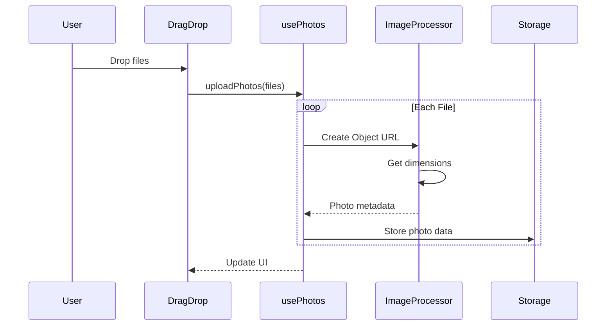

# Implementation Details

## Photo Management

### Upload Process



1. File Processing
```typescript
// Create temporary URL for preview
const url = URL.createObjectURL(file)

// Get image dimensions asynchronously
const dimensions = await new Promise<{ width: number; height: number }>((resolve) => {
  const img = new Image()
  img.onload = () => {
    resolve({
      width: img.width,
      height: img.height
    })
  }
  img.src = url
})
```

2. Memory Management
```typescript
// Clean up object URLs when removing photos
const removePhoto = (id: string) => {
  setPhotos(prev => {
    const photo = prev.find(p => p.id === id)
    if (photo?.url) {
      URL.revokeObjectURL(photo.url)
    }
    return prev.filter(p => p.id !== id)
  })
}
```

## Layout Management

### Layout Algorithms

1. Grid Layout
```typescript
const generateGridLayout = (photos: Photo[]) => {
  const margin = 20
  const maxWidth = wallDimensions.width - margin * 2
  const maxHeight = wallDimensions.height - margin * 2
  
  // Calculate optimal grid dimensions
  const cols = Math.ceil(Math.sqrt(photos.length))
  const rows = Math.ceil(photos.length / cols)
  
  // Calculate frame dimensions
  const frameWidth = (maxWidth - margin * (cols - 1)) / cols
  const frameHeight = (maxHeight - margin * (rows - 1)) / rows
  
  // Position frames
  const newFrames = photos.map((photo, index) => {
    const row = Math.floor(index / cols)
    const col = index % cols
    
    return {
      id: generateId(),
      photoId: photo.id,
      x: margin + col * (frameWidth + margin),
      y: margin + row * (frameHeight + margin),
      width: frameWidth,
      height: frameHeight,
      rotation: 0
    }
  })
}
```

2. Salon Layout
```typescript
const generateSalonLayout = (photos: Photo[]) => {
  const margin = 20
  const newFrames = photos.map((photo) => {
    // Random size variation
    const scale = 0.8 + Math.random() * 0.4
    
    return {
      id: generateId(),
      photoId: photo.id,
      x: margin + Math.random() * (wallDimensions.width - 200),
      y: margin + Math.random() * (wallDimensions.height - 200),
      width: photo.width * scale,
      height: photo.height * scale,
      rotation: (Math.random() - 0.5) * 10 // Slight rotation
    }
  })
}
```

### Frame Manipulation

1. Position Updates
```typescript
const updateFrame = (updatedFrame: Frame) => {
  setFrames(prev => 
    prev.map(frame => 
      frame.id === updatedFrame.id ? updatedFrame : frame
    )
  )
}
```

2. Collision Detection
```typescript
const checkCollision = (frame1: Frame, frame2: Frame) => {
  return !(
    frame1.x + frame1.width < frame2.x ||
    frame1.x > frame2.x + frame2.width ||
    frame1.y + frame1.height < frame2.y ||
    frame1.y > frame2.y + frame2.height
  )
}
```

## State Management

### Context Integration

```typescript
// Provider setup
export function ArtWallProvider({ children }: { children: ReactNode }) {
  const photoState = usePhotos()
  const layoutState = useLayout()

  return (
    <ArtWallContext.Provider
      value={{
        ...photoState,
        ...layoutState
      }}
    >
      {children}
    </ArtWallContext.Provider>
  )
}

// Hook usage
export function useArtWall() {
  const context = useContext(ArtWallContext)
  if (!context) {
    throw new Error('useArtWall must be used within an ArtWallProvider')
  }
  return context
}
```

### State Updates

```typescript
// Photo state updates
const [photos, setPhotos] = useState<Photo[]>([])
const [loading, setLoading] = useState(false)
const [error, setError] = useState<string | null>(null)

// Layout state updates
const [frames, setFrames] = useState<Frame[]>([])
const [layoutType, setLayoutType] = useState<LayoutType>('grid')
const [wallDimensions, setWallDimensions] = useState({
  width: 1200,
  height: 800
})
```

## Performance Optimizations

1. Memoization
```typescript
const calculatePosition = useCallback(() => {
  // Position calculation logic
}, [wallDimensions])
```

2. Batch Updates
```typescript
const generateLayout = useCallback((photos: Photo[], type: LayoutType) => {
  // Clear existing layout and set new type in one update
  setFrames([])
  setLayoutType(type)
  
  // Generate new frames
  const newFrames = generateFrames(photos, type)
  setFrames(newFrames)
}, [])
```

3. Cleanup
```typescript
useEffect(() => {
  if (isVisible) {
    window.addEventListener("scroll", calculatePosition)
    window.addEventListener("resize", calculatePosition)
    
    return () => {
      window.removeEventListener("scroll", calculatePosition)
      window.removeEventListener("resize", calculatePosition)
    }
  }
}, [isVisible, calculatePosition])
```

## Error Handling

```typescript
const uploadPhotos = async (files: FileList) => {
  setLoading(true)
  setError(null)
  
  try {
    const newPhotos = await Promise.all(
      Array.from(files).map(processPhoto)
    )
    setPhotos(prev => [...prev, ...newPhotos])
  } catch (err) {
    setError(err instanceof Error ? err.message : 'Failed to upload photos')
  } finally {
    setLoading(false)
  }
}
